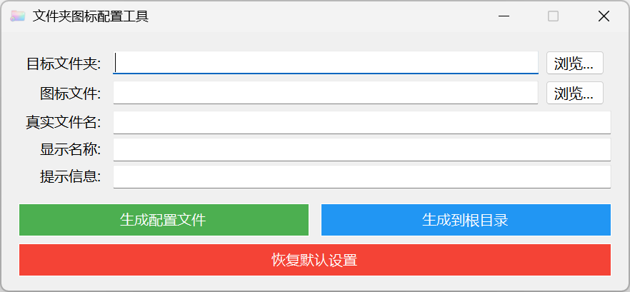

# FolderMagic

FolderMagic 是一个 Windows 文件夹图标配置工具，使用 C# 实现。
🖼️ 文件夹图标配置工具



## 功能

- 支持选择或拖入目标文件夹。
- 支持选择或拖入 `.ico` 图标文件。
- 图标不是必填项；可以只设置文件夹显示名称和提示信息。
- 支持将图标保存到目标文件夹内，或保存到驱动器根目录的 `ICOconfig` 目录。
- 生成或恢复配置后会调用 Windows Shell API 触发图标刷新。

## 构建与运行

```powershell
dotnet build FolderMagic.sln
dotnet run --project FolderMagic.WinForms
```

## 实现原理

程序通过创建或修改目标文件夹中的 `desktop.ini` 来设置文件夹显示信息：

```ini
[.ShellClassInfo]
LocalizedResourceName=显示名称
InfoTip=提示信息
IconResource=图标文件,0
```

随后设置 `desktop.ini` 和目标文件夹属性，并通过 `SHChangeNotify` 通知 Windows Shell 刷新图标状态。
